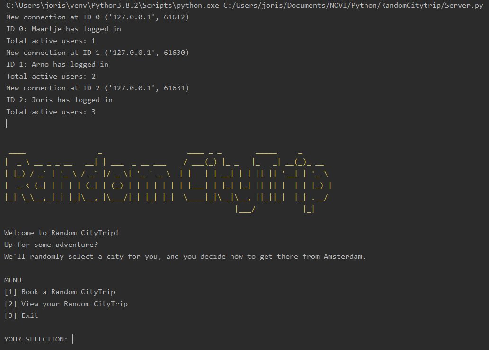

# random-citytrip
Multithreaded networking application in the terminal, in order to get to know Python.

###### Execute the app:
1. Start the server with the terminal command `python Server.py`
2. Start one of the three provided clients: `python Client_1.py`

